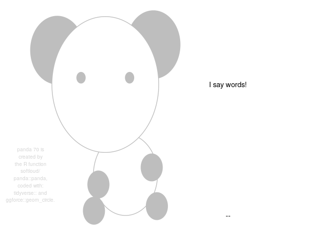
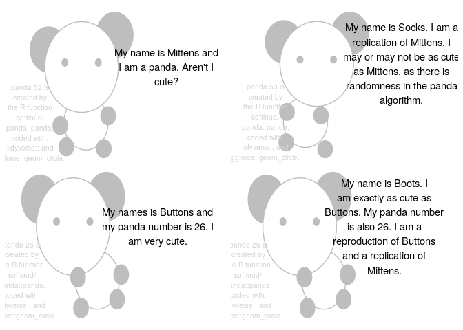
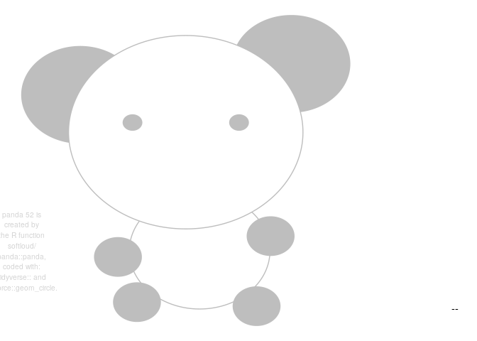
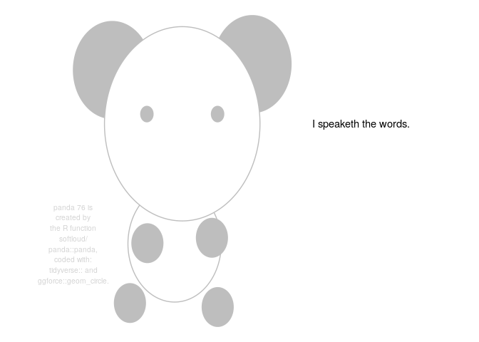
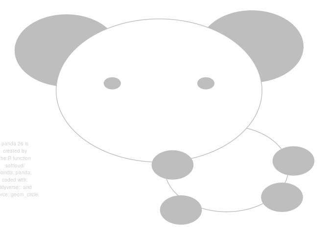
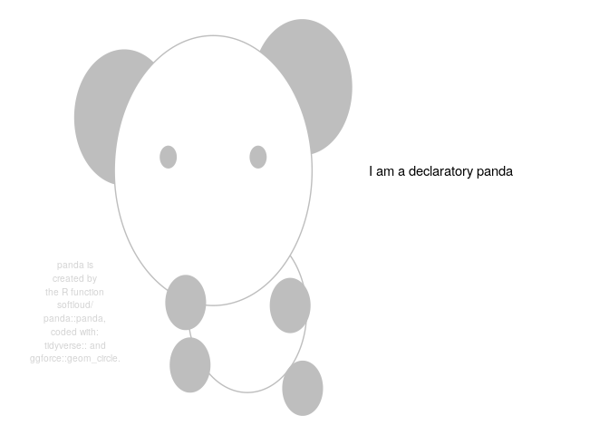
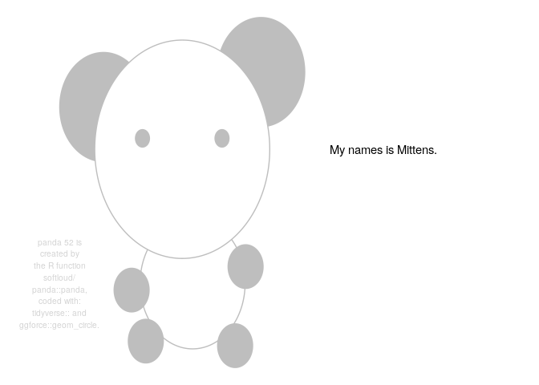

<!-- README.md is generated from README.Rmd. Please edit that file -->

# panda

<!-- badges: start -->

<!-- badges: end -->

The goal of panda is to make panda pictures that say my words.

``` r
library(panda)

panda("I say words!")
#> Set panda = 47 to reproduce this panda.
```



## installation

And the development version from [GitHub](https://github.com/) with:

``` r
# install.packages("devtools")
devtools::install_github("softloud/panda")
```

## motivating usage

``` r
library(patchwork)

panda(mittens_msg, panda = 52) +
  panda(socks_msg) +
  panda(buttons_msg, panda = 26) +
  panda(boots_msg, panda = 26)
#> Set panda = 52 to reproduce this panda.
#> Set panda = 53 to reproduce this panda.
#> Set panda = 26 to reproduce this panda.
#> Set panda = 26 to reproduce this panda.
```



## how to make a panda

``` r
# random panda
panda()
#> Set panda = 52 to reproduce this panda.
```



``` r
# panda speaks
panda("I speaketh the words.")
#> Set panda = 53 to reproduce this panda.
```



``` r
# selct specific panda
panda(panda = 26)
#> Set panda = 26 to reproduce this panda.
```



``` r
# select from default pandas
pandas
#> # A tibble: 5 x 3
#>   descriptor   seed type 
#>   <chr>       <dbl> <chr>
#> 1 declaratory    73 mood 
#> 2 wondering      26 mood 
#> 3 Mittens        52 name 
#> 4 Boots          26 name 
#> 5 Buttons        26 name
```

``` r
# select panda by name or mood
panda(descriptor = "declatory",
      msg = "I am a declaratory panda")
#> Set panda =  to reproduce this panda.
```



``` r
panda(descriptor = "Mittens",
      msg = "My name is Mittens.")
#> Set panda = 52 to reproduce this panda.
```


