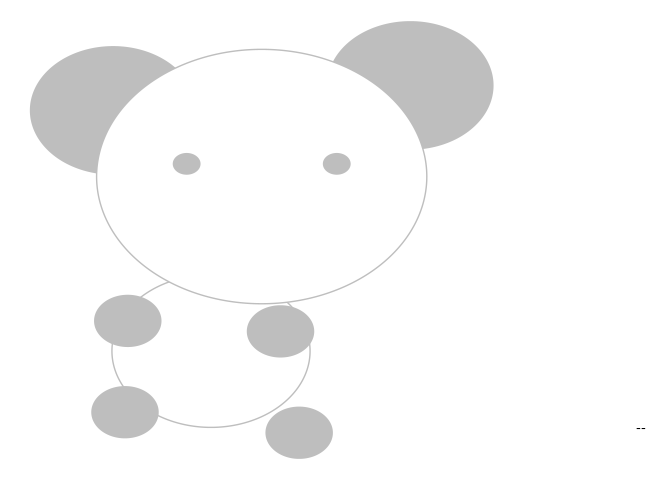
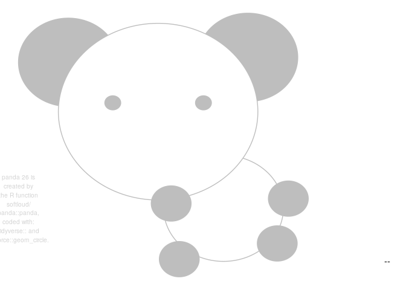

<!-- README.md is generated from README.Rmd. Please edit that file -->

# panda

<!-- badges: start -->

<!-- badges: end -->

The goal of panda is to make panda pictures that say my words.

``` r
library(panda)

panda("I say words!")
#> Set panda = 70 to reproduce this panda.
```


## installation

And the development version from [GitHub](https://github.com/) with:

``` r
# install.packages("devtools")
devtools::install_github("softloud/panda")
```

## motivating usage

``` r
library(patchwork)

rvr <- panda(mittens_msg, panda = 52) +
  panda(socks_msg) +
  panda(buttons_msg, panda = 26) +
  panda(boots_msg, panda = 26)
#> Set panda = 52 to reproduce this panda.
#> Set panda = 53 to reproduce this panda.
#> Set panda = 26 to reproduce this panda.
#> Set panda = 26 to reproduce this panda.

# usethis::use_data(rvr, overwrite = TRUE)
# 

rvr
```


## how to make a panda

``` r
# random panda
panda()
#> Set panda = 52 to reproduce this panda.
```


``` r

# random panda no information stamped on image about panda number
panda(stamp = FALSE)
#> Set panda = 53 to reproduce this panda.
#> Warning: Removed 1 rows containing missing values (geom_text).
```



``` r
# panda speaks
panda("I speaketh the words.")
#> Set panda = 76 to reproduce this panda.
```


``` r
# selct specific panda
panda(panda = 26)
#> Set panda = 26 to reproduce this panda.
```



``` r
# select from default pandas
pandas
#> # A tibble: 6 x 4
#>   descriptor   seed type  adopted_by 
#>   <chr>       <dbl> <chr> <chr>      
#> 1 declaratory    73 mood  <NA>       
#> 2 wondering      26 mood  <NA>       
#> 3 Mittens        52 name  softloud   
#> 4 Boots          26 name  softloud   
#> 5 Buttons        26 name  softloud   
#> 6 Beanie         17 name  jenrichmond
```

``` r
# select panda by name or mood
panda(descriptor = "declatory",
      msg = "I am a declaratory panda")
panda(descriptor = "Mittens",
      msg = "My name is Mittens.")
```

## gallery

``` r
# moods
```

``` r
# pandas by name
```
